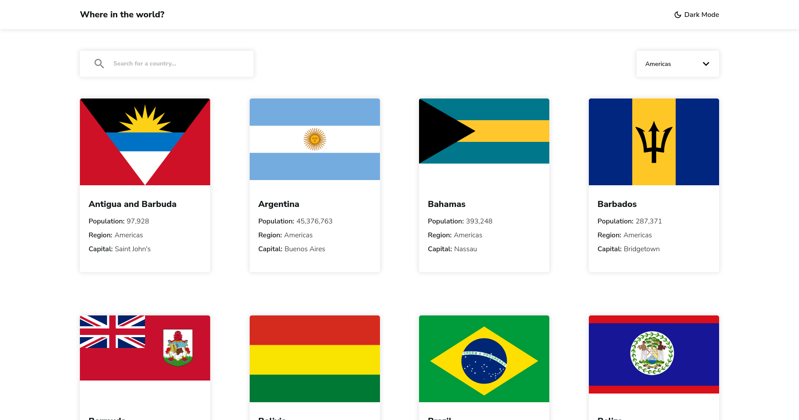

# Frontend Mentor - REST Countries API with color theme switcher solution

This is a solution to the [REST Countries API with color theme switcher challenge on Frontend Mentor](https://www.frontendmentor.io/challenges/rest-countries-api-with-color-theme-switcher-5cacc469fec04111f7b848ca). Frontend Mentor challenges help you improve your coding skills by building realistic projects.

## Table of contents

- [Overview](#overview)
  - [The challenge](#the-challenge)
  - [Screenshot](#screenshot)
  - [Links](#links)
- [My process](#my-process)
  - [Built with](#built-with)
- [Author](#author)

## Overview

Your challenge is to integrate with the [REST Countries V2 API](https://restcountries.com/#api-endpoints-v2) to pull country data and display it like in the designs.

### The challenge

Users should be able to:

- See all countries from the API on the homepage
- Search for a country using an `input` field
- Filter countries by region
- Click on a country to see more detailed information on a separate page
- Click through to the border countries on the detail page
- Toggle the color scheme between light and dark mode

### Screenshot

### Links

- Solution URL: [My solution]()
- Live Site URL: [Live Site](https://chris-base.github.io/rest-countries-api-app/)

## My process

Started with clean React app, made layouts for both pages (Countries List Page/Individual country info page). Made layouts for both desktop and mobile sized screens. Made interactive sections (Input element for search bar/drop down for region selector). Made API calls using [Rest Countries](https://restcountries.com/#api-endpoints-v2). Added dark/light toggleable.

### Built with

- Semantic HTML5 markup
- CSS custom properties
- Flexbox
- CSS Grid
- Mobile-first workflow
- [React](https://reactjs.org/) - JS library
- [REST Countries V2 API](https://restcountries.com/#api-endpoints-v2)

## Author

- Website - [Chris Base](https://github.com/chris-base)
- Frontend Mentor - [@chris-base](https://www.frontendmentor.io/profile/chris-base)
